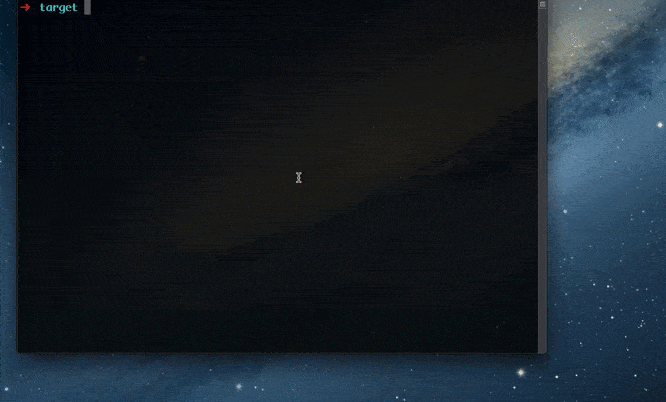

# animation
无意中发现的大二java作业，自己扣的图，快乐代码
## Usage
```
 > mvn pacakge
 > java -jar animation-1.0-SNAPSHOT.jar
```


添加四张图片，然后点击更换图片，动画开始，可以上下左右移动

## 图片

|      |  |
| ------- | ---------------------------------------------------------- |
| AK      |  |
| Delevin |  |
| YaoMing |  |
| Zombie |  |

[其他图片](./image)

